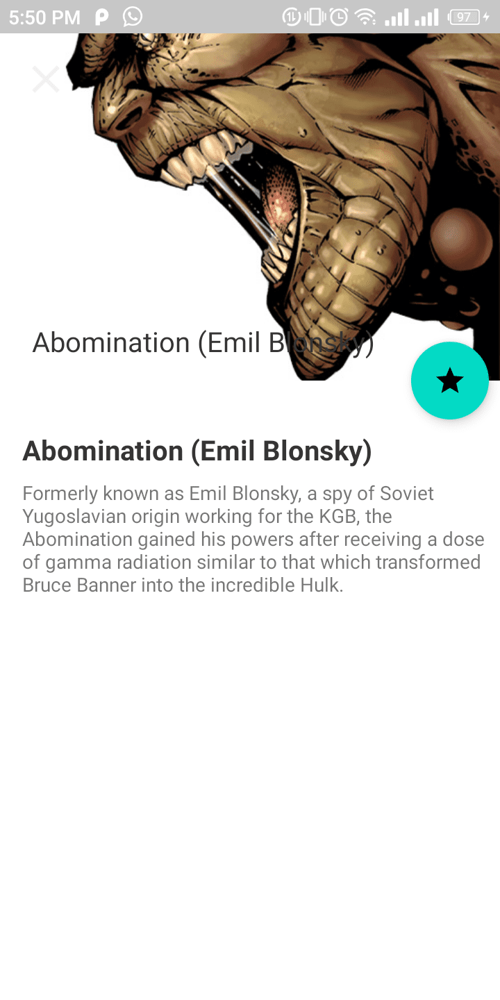

# Marvel Comics App
Hey there! 👋🏼👋🏼👋🏼

This android application helps you view your favorite marvel characters. 
With this application, you can view a list of all marvel characters in the marvel universe,
go through the character’s details in an expanded detail view, and add or remove characters 
to a favorite list.

#### Prerequisite
To build this project, you require:

- Android Studio Canary version
- Gradle 7.0
- Kotlin 1.5.21

### Steps

- The application communicates with the marvel API which can be found [here](https://developer.marvel.com/).
You are required to create an account to generate your API keys, and use these credentials
to make your queries.

- After generating your private and public keys, put them in your local.properties file, which usually
gets ignored by default by the git version control system (VCS). 

- Install the Google Secrets dependency which hides keys so they don't get checked into git VCS.
Do this by placing "id 'com.google.secrets_gradle_plugin' version 'x'" with the latest version x
specified by you among your plugins found in the build.gradle file. 

- Sync the project and Android studio generates constants representing your keys in your BuildConfig
class. You can then use these variables from your application securely.

#### Features:
- MVVM Architecture
- API requests to server via Retrofit
- Asynchronous operations using Kotlin Coroutines
- LiveData and Kotlin Flow to monitor values in real time
- Room database to store favourites
- Dependency Injection using Hilt
- Image loading and caching using Glide
- Jetpack Navigation

#### Screenshots
- View all Marvel characters

- View a character in detail

- List of all favourite characters
